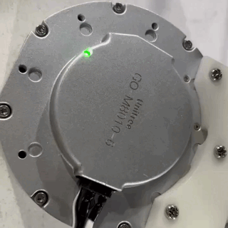
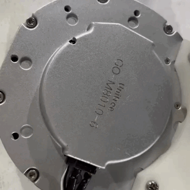

# Unitree MotorToolbox  
This is a set of tools to operate the internal configuration of the motor through the RS-485 bus.

## Overview

`unisp`: Upgrade motor firmware .  
`changeid`: If you have multiple motors connected to a RS-485 bus, you need to change them to separate ID.  
`swboot`: Switch to Bootloader mode and then while be list all the motors.  
`swmotor`: Switch to motor mode (Default), Motor while be enable.(Configuration cannot be modified)  
`cancelboot`: Rescue modes, such as misoperation (such as upgrade failure), cause the motor to turn into brick.  

### How to distinguish which mode the motor is currently in?  
Look at the green LED on the back of the motor.

|  Motor Mode   | Bootloader Mode  |
|  ----  | ----  |
|   |  |
| Slow Blink.  | Fast Blink 3 times. |

## Using

The downloaded linux executable file does not have permission to run directly, please:  
`sudo chmod 777 ./unisp ./changeid ./swboot ./swmotor ./cancelboot`  
run example for changeid:  
`sudo ./changeid /dev/ttyUSB0 0 2`

## Other

Unitree MotorToolbox does not require root permissions to function properly, but the exception is that your `ttyUSB` device must have sufficient permissions. like: 

`sudo chmod 777 /dev/ttyUSB0`